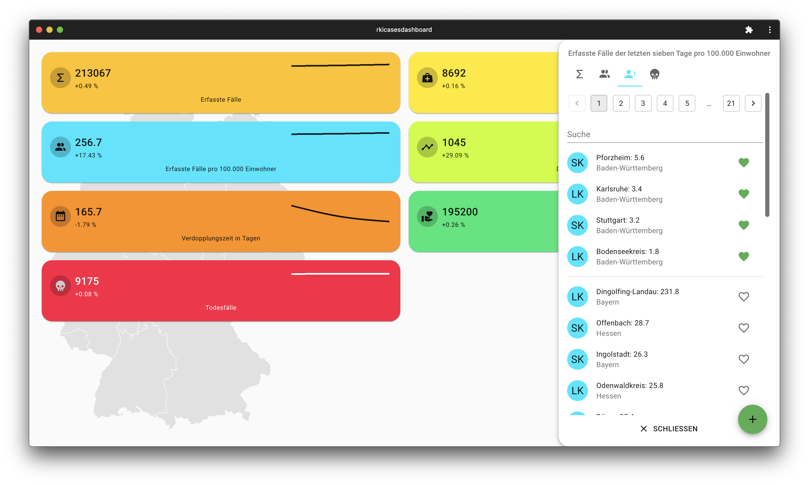
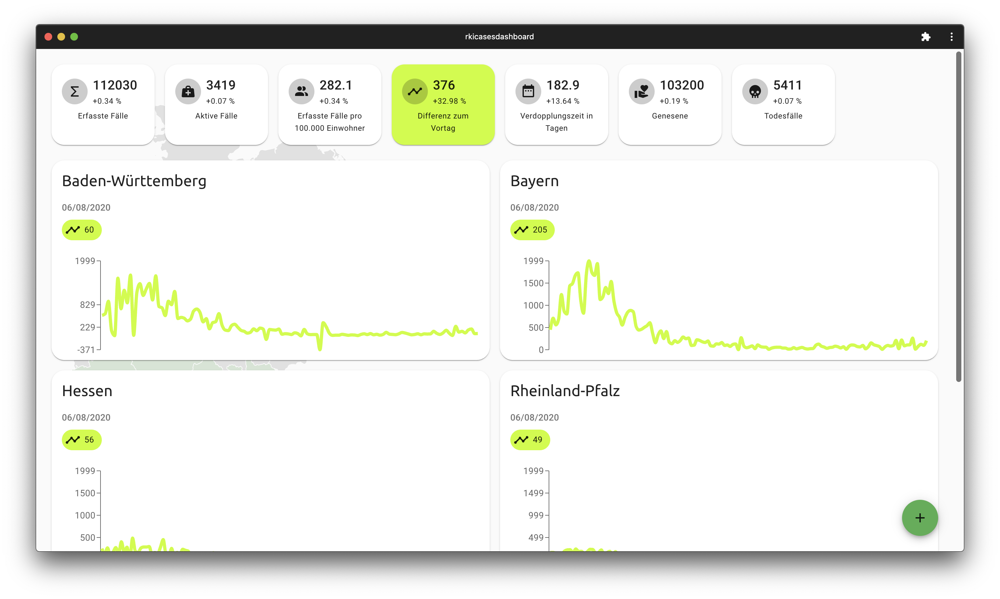
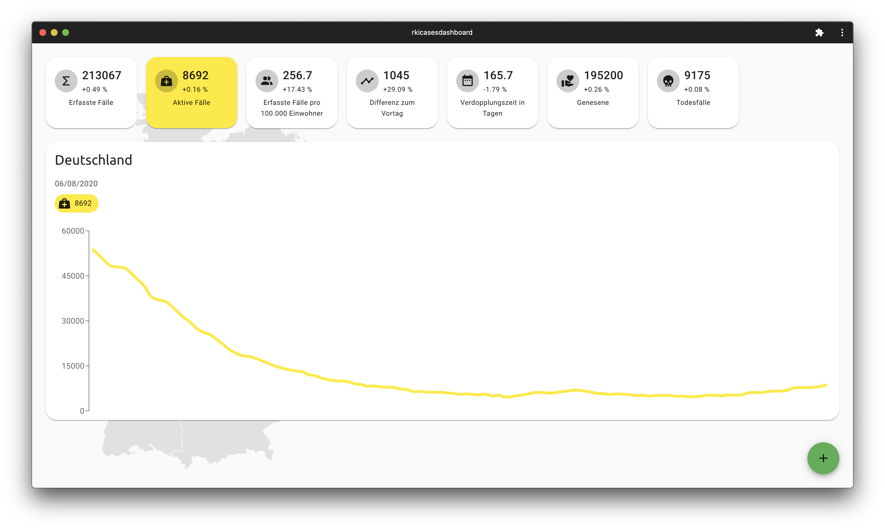

# rkicasesdashboard

## about this project

tracks the spread of the disease in germany on a state and county level. The poor experience, especially on mobile devices, by the [official dashboard](https://experience.arcgis.com/experience/478220a4c454480e823b17327b2bf1d4) inspired me to develop something on my own. The project uses scheduled functions, to create its own data layer, namely: firestore. This enables the webapp to work offline. A simple [REST API](https://github.com/fabianhinz/rkicasesapi) provides easy access to the data

## Disclaimer 

Das Dashboard beinhaltet Daten ab dem 20.03.2020. Verdopplungsraten werden auf Basis der drei aktuellsten Datenpunkte in einem gegebenen Intervall berechnet. Ausreißer lassen sich durch nicht gemeldete Fallzahlen des jeweiligen Landes zum Zeitpunkt der Datensammlung begründen.

## Informationen

- PWA zur Darstellung von COVID-19: Fallzahlen in Deutschland
- Datenquelle: [rkicasesapi](https://github.com/fabianhinz/rkicasesapi)
- Die Anwendung wird über firebase gehostet https://rkicasesapi.web.app/
- Icons made by [Freepik](https://www.flaticon.com/authors/freepik)
- Karte von [simplemaps](http://simplemaps.com/resources/svg-maps)
- Die Daten von Land- und Stadtkreisen werden von [esri](https://www.esri.de/de-de/home) bezogen

___

> mobile layout

> state layout

> country layout

