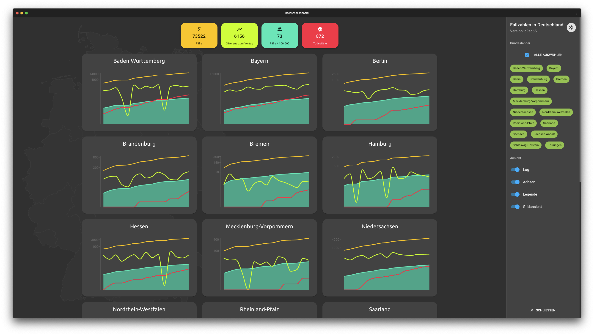

# rkicasesdashboard

- PWA zur Darstellung von COVID-19: Fallzahlen in Deutschland
- Datenquelle: [rkicasesapi](https://github.com/fabianhinz/rkicasesapi)
- Die Anwendung wird über firebase gehostet https://rkicasesapi.web.app/
- Deutschlandkarte von [wikipedia](https://upload.wikimedia.org/wikipedia/commons/e/e3/Karte_Deutschland.svg)

___

