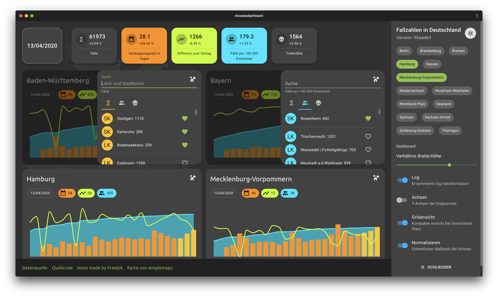

# rkicasesdashboard

## Disclaimer 

Das Dashboard beinhaltet Daten ab dem 20.03.2020. Verdopplungsraten werden auf Basis der drei aktuellsten Datenpunkte in einem gegebenen Intervall berechnet. Ausreißer lassen sich durch nicht gemeldete Fallzahlen des jeweiligen Landes zum Zeitpunkt der Datensammlung begründen.

## Informationen

- PWA zur Darstellung von COVID-19: Fallzahlen in Deutschland
- Datenquelle: [rkicasesapi](https://github.com/fabianhinz/rkicasesapi)
- Die Anwendung wird über firebase gehostet https://rkicasesapi.web.app/
- Icons made by [Freepik](https://www.flaticon.com/authors/freepik)
- Karte von [simplemaps](http://simplemaps.com/resources/svg-maps)
- Die Daten von Land- und Stadtkreisen werden von [esri](https://www.esri.de/de-de/home) bezogen

___

